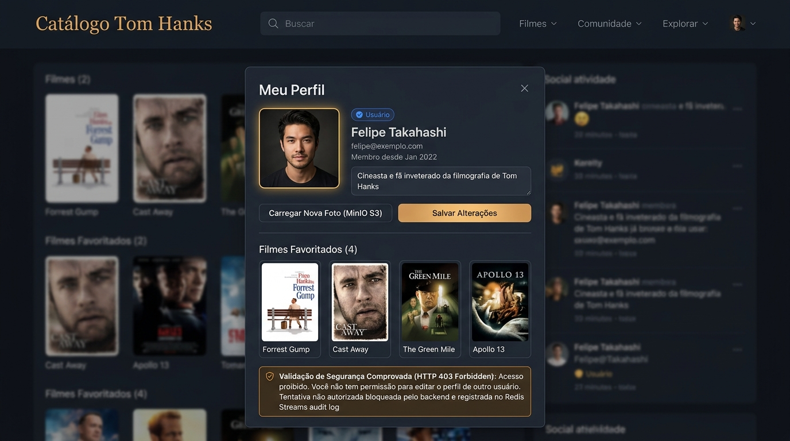

# 🎬 Catálogo de Filmes — Tom Hanks (Microsserviços, RBAC, Logs de Auditoria & Object Storage MinIO)

> Atividades Práticas 3, 4, 5 e 6 da disciplina **ISW055 - Introdução à Computação em Nuvem**  
> Professor: **Allan Siriani** ([@siriani](https://github.com/siriani))

---

## 📌 Visão Geral da Arquitetura

O sistema implementa uma **arquitetura de microsserviços desacoplados e distribuídos** para exibição de filmes, autenticação segura com RBAC, observabilidade centralizada com Redis Streams e **armazenamento de objetos com MinIO (S3)**:

1. **`catalogo`**: Ponto único de entrada público da aplicação (porta 3000), hospedando a SPA em React 19 e o backend Express que orquestra as regras de negócio de filmes, favoritos, perfil com fotos e moderação de comentários.
2. **`auth-service`**: Microsserviço de autenticação, cadastro, papéis de usuário (`role`), tokens JWT e redefinição de senhas com envio de e-mail transacional (porta 4000 interna).
3. **`log-service`**: Microsserviço dedicado de observabilidade e auditoria (porta 5000 interna), responsável por receber eventos de todos os serviços e gravá-los no Redis Streams via `XADD`.
4. **`redis`**: Banco NoSQL em memória com persistência AOF (porta 6379 interna), armazenando a stream cronológica `audit:events`.
5. **`minio`**: Object Storage compatível com AWS S3 (porta 9000 API / 9001 Console), armazenando arquivos binários de fotos de perfil em bucket dedicado (`catalogo-perfil`).
6. **`mariadb`**: Banco de dados relacional para persistência de dados estruturados de negócio (usuários com bio e foto_key, favoritos, comentários e tokens de redefinição).

```
               ┌────────────────────────────────────────────────────────────────────────────────────────┐
               │                           Rede Docker Interna (app-network)                            │
               │                                                                                        │
┌─────────────┐│   ┌───────────────────────┐         ┌───────────────────────────────┐                  │
│  Navegador  ││   │  Catálogo + Backend   │  HTTP   │         auth-service          │                  │
│ (Usuário /  │┼──>│ (Ponto Único Público) │────────>│    (Auth, Roles, Senha)       │                  │
│   Admin)    ││   │     Porta :3000       │         │    (SEM PORTA NO HOST)        │                  │
└──────┬──────┘│   └───┬───────────────┬───┘         │         Porta :4000           │                  │
       │       │       │               │             └───────────────┬───────────────┘                  │
       │       │       │ Eventos       │ Upload Binário              │ Eventos                          │
       │       │       │ (audit)       │ S3 PutObject                │ (login, 403)                     │
       │       │       ▼               ▼                             ▼                                  │
       │       │   ┌───────────────┐ ┌───────────────────────────┐ ┌──────────────────────────────┐    │
       │       │   │  log-service  │ │     MinIO Object Storage  │ │  Redis Streams (audit:events)│    │
       │       │   │  Porta :5000  │ │  Bucket: catalogo-perfil  │ │  Porta :6379                 │    │
       │       │   └───────┬───────┘ │  Porta :9000 / :9001      │ └──────────────────────────────┘    │
       │       │           │ XADD    └─────────────┬─────────────┘                                      │
       │       │           ▼                       │ Leitura Pública de Imagens                         │
       └───────┼───────────────────────────────────┼────────────────────────────────────────────────────┘
               │                                   │ (URL do Avatar montada sob demanda)
               │                                   ▼
               │                         ┌───────────────────┐
               │                         │    Navegador      │
               │                         │ (Exibição Foto)   │
               │                         └───────────────────┘
               │
               │ Referência (foto_key, bio, favoritos, comentarios)
               ▼
     ┌───────────────────────────────────────────────────────────────────────┐
     │                                MariaDB                                │
     │       (usuarios [bio, foto_key], reset_tokens, favoritos, coment.)    │
     └───────────────────────────────────────────────────────────────────────┘
```

---

## 🐳 Docker Compose: 5 Serviços e Rede Isolada

O arquivo [`docker-compose.yml`](docker-compose.yml) orquestra os **5 serviços desacoplados** conectados através da rede compartilhada `app-network`:

```yaml
version: '3.8'

services:
  # 1. Container do Catálogo (Frontend SPA + Backend TMDB/Favoritos/Comentários/Perfil/Storage)
  catalogo:
    build:
      context: .
      dockerfile: Dockerfile
    ports:
      - "${PORT:-3000}:3000" # Único serviço com porta web de aplicação pública
    environment:
      - PORT=3000
      - AUTH_SERVICE_URL=http://auth-service:4000
      - LOG_SERVICE_URL=http://log-service:5000
      - DB_HOST=${DB_HOST:-mariadb}
      - DB_PORT=${DB_PORT:-3306}
      - DB_USER=${DB_USER:-aluno}
      - DB_PASSWORD=${DB_PASSWORD:-alunosenha}
      - DB_NAME=${DB_NAME:-catalogo_filmes}
      - TMDB_API_KEY=${TMDB_API_KEY}
      - JWT_SECRET=${JWT_SECRET:-chave_jwt_secreta_local_dev}
      - MINIO_ENDPOINT=${MINIO_ENDPOINT:-minio}
      - MINIO_PORT=${MINIO_PORT:-9000}
      - MINIO_USE_SSL=${MINIO_USE_SSL:-false}
      - MINIO_ROOT_USER=${MINIO_ROOT_USER:-minioadmin}
      - MINIO_ROOT_PASSWORD=${MINIO_ROOT_PASSWORD:-minioadmin}
      - MINIO_BUCKET=${MINIO_BUCKET:-catalogo-perfil}
      - MINIO_PUBLIC_URL=${MINIO_PUBLIC_URL:-http://localhost:9000}
      - AVATAR_STORAGE_MODE=${AVATAR_STORAGE_MODE:-public}
    depends_on:
      - auth-service
      - log-service
      - minio
    networks:
      - app-network
    restart: unless-stopped

  # 2. Microsserviço de Autenticação (Login, Cadastro, RBAC, Tokens e Troca de Senha)
  # ATENÇÃO: Sem 'ports' publicado pro host - acessível APENAS via rede Docker interna
  auth-service:
    build:
      context: ./auth-service
      dockerfile: Dockerfile
    expose:
      - "4000" # Sem porta no host
    environment:
      - PORT=4000
      - LOG_SERVICE_URL=http://log-service:5000
      - DB_HOST=${DB_HOST:-mariadb}
      - DB_PORT=${DB_PORT:-3306}
      - DB_USER=${DB_USER:-aluno}
      - DB_PASSWORD=${DB_PASSWORD:-alunosenha}
      - DB_NAME=${DB_NAME:-catalogo_filmes}
      - JWT_SECRET=${JWT_SECRET:-chave_jwt_secreta_local_dev}
      - APP_URL=${APP_URL:-http://localhost:3000}
    depends_on:
      - log-service
    networks:
      - app-network
    restart: unless-stopped

  # 3. Microsserviço de Observabilidade e Logs de Auditoria (Atividade 5)
  # ATENÇÃO: Sem 'ports' publicado pro host - acessível APENAS internamente
  log-service:
    build:
      context: ./log-service
      dockerfile: Dockerfile
    expose:
      - "5000" # Sem porta no host
    environment:
      - PORT=5000
      - REDIS_HOST=redis
      - REDIS_PORT=6379
      - REDIS_STREAM_KEY=${REDIS_STREAM_KEY:-audit:events}
    depends_on:
      - redis
    networks:
      - app-network
    restart: unless-stopped

  # 4. Redis para Streams de Auditoria (Append-Only File habilitado)
  # ATENÇÃO: Sem porta no host - acessível APENAS na rede interna do Docker
  redis:
    image: redis:7-alpine
    command: redis-server --appendonly yes
    expose:
      - "6379" # Sem porta no host
    volumes:
      - redis-data:/data
    networks:
      - app-network
    restart: unless-stopped

  # 5. MinIO - Object Storage para Fotos de Perfil (Atividade 6)
  minio:
    image: quay.io/minio/minio:latest
    command: server /data --console-address ":9001"
    ports:
      - "${MINIO_PORT:-9000}:9000"          # API S3 pública para leitura das fotos
      - "${MINIO_CONSOLE_PORT:-9001}:9001"  # Painel de controle Web MinIO
    environment:
      - MINIO_ROOT_USER=${MINIO_ROOT_USER:-minioadmin}
      - MINIO_ROOT_PASSWORD=${MINIO_ROOT_PASSWORD:-minioadmin}
    volumes:
      - minio-data:/data
    networks:
      - app-network
    restart: unless-stopped

volumes:
  redis-data:
    driver: local
  minio-data:
    driver: local

networks:
  app-network:
    driver: bridge
```

---

## 🔒 Confirmação de Isolamento e Segurança da Rede

> [!IMPORTANT]
> **Confirmação de Segurança e Desacoplamento:**
> - Os containers **`auth-service`**, **`log-service`** e **`redis` NÃO possuem a diretiva `ports:` configurada**.
> - Eles utilizam exclusivamente **`expose`**, o que significa que suas portas internas (**4000**, **5000** e **6379**) **NÃO são publicadas/mapeadas para a máquina host nem para a internet**.
> - O container **`minio`** publica a porta **9000** (para download direto e leitura pública de fotos no Object Storage conforme o Requisito 3) e **9001** (Console Web administrativo).
> - O ponto de entrada principal da aplicação web continua sendo estritamente o **`catalogo`** (`ports: - "${PORT:-3000}:3000"`).

### 📋 Tabela Comparativa de Exposição de Portas

| Serviço | Porta Interna | Publicada no Host (`ports`)? | Acessível Externamente? | Comunicação Permitida |
|---|---|---|---|---|
| **`catalogo`** | `3000` | **Sim** (`${PORT:-3000}:3000`) | **Sim** (Navegador / Portainer) | Usuário final ↔ Aplicação |
| **`auth-service`** | `4000` | **NÃO** (apenas `expose: 4000`) | **NÃO** (Bloqueada pro host) | Interna via `app-network` (`http://auth-service:4000`) |
| **`log-service`** | `5000` | **NÃO** (apenas `expose: 5000`) | **NÃO** (Bloqueada pro host) | Interna via `app-network` (`http://log-service:5000`) |
| **`redis`** | `6379` | **NÃO** (apenas `expose: 6379`) | **NÃO** (Bloqueada pro host) | Interna via `app-network` (`redis:6379`) |
| **`minio`** | `9000`, `9001` | **Sim** (`9000:9000`, `9001:9001`) | **Sim** (S3 API e Console) | Leitura pública de fotos / Admin Console |

---

## 📸 Demonstração Prática dos Fluxos

### 1. Fluxo Completo de Esqueci a Senha (Pedido → E-mail Brevo → Link Usado → Senha Trocada)

O fluxo de recuperação de senha segue um ciclo completo e seguro:
1. **Pedido**: O usuário acessa a aba *"Recuperar Senha"* no Catálogo e informa seu e-mail cadastrado (`ftanaka91@gmail.com`).
2. **Geração Segura**: O `auth-service` gera um token criptográfico aleatório de 32 bytes (64 caracteres hexadecimais), grava na tabela `reset_tokens` com validade estrita de 30 minutos (`DATE_ADD(NOW(), INTERVAL 30 MINUTE)`) e status `usado = FALSE`.
3. **E-mail Recebido (Brevo)**: O e-mail transacional é enviado via Brevo (SMTP ou API REST) para o e-mail real do usuário contendo o botão estilizado *"Redefinir Minha Senha"* apontando para o link único `/#reset-token=<token>`.
4. **Link Usado e Validado**: Ao abrir o link, o frontend consulta o `auth-service` (`GET /api/auth/verify-reset-token/:token`), que confirma que o token é válido, pertence ao usuário e ainda não expirou, exibindo a mensagem: *"Link verificado com sucesso! Digite sua nova senha abaixo."*
5. **Senha Trocada**: O usuário digita a nova senha, que é criptografada com `bcrypt` (10 rounds de salt) no MariaDB, o token é marcado como `usado = TRUE` para prevenir reutilização e o acesso é liberado com sucesso.


---

### 2. Tentativas Recusadas: Link Expirado (> 30 Minutos) e Token Já Utilizado / Inválido

O `auth-service` implementa uma **validação rigorosa em 3 etapas** antes de autorizar qualquer troca de senha:

```
Requisição de Troca ──> 1. Token existe no banco? ──Não──> ❌ Erro: Token inválido ou inexistente
                                │ Sim
                                ▼
                        2. Token já foi usado?   ──Sim──> ❌ Erro: Link já utilizado
                                │ Não (usado = false)
                                ▼
                        3. Token expirou (>30m)? ──Sim──> ❌ Erro: Link expirou (30 min)
                                │ Não (agora <= expira_em)
                                ▼
                        ✅ Permite redefinir a nova senha
```

#### Evidências Visuais das Recusas:

1. **Tentativa com Link Já Utilizado (Superior)**:
   - Ao tentar reutilizar um link cujo token já teve `usado = TRUE` registrado no banco, a aplicação recusa a operação:
   > **`"Este link de recuperação já foi utilizado. Solicite um novo link."`**

2. **Tentativa Após 30 Minutos / Expirado (Inferior)**:
   - Se o usuário tentar abrir o link após a janela de 30 minutos (`NOW() > expira_em`), a validação rejeita o acesso:
   > **`"Este link de recuperação expirou (validade de 30 minutos). Solicite um novo link."`**


---

## 🗄️ Modelo do Banco de Dados

### 1. Tabela `usuarios` (Autenticação, Perfis e Referência ao MinIO)
```sql
CREATE TABLE IF NOT EXISTS usuarios (
  id INT AUTO_INCREMENT PRIMARY KEY,
  nome VARCHAR(100) NOT NULL,
  email VARCHAR(150) UNIQUE NOT NULL,
  senha_hash VARCHAR(255) NOT NULL,
  role VARCHAR(50) NOT NULL DEFAULT 'usuario', -- Papéis: 'usuario' ou 'admin'
  bio TEXT NULL,                               -- Bio curta do perfil (Atividade 6)
  foto_key VARCHAR(255) NULL,                  -- Chave do objeto no MinIO (Atividade 6)
  criado_em TIMESTAMP DEFAULT CURRENT_TIMESTAMP
) ENGINE=InnoDB DEFAULT CHARSET=utf8mb4;
```

### 2. Tabela `reset_tokens` (Gerenciada pelo `auth-service` com Expiração de 30 Min)
```sql
CREATE TABLE IF NOT EXISTS reset_tokens (
  id INT AUTO_INCREMENT PRIMARY KEY,
  token VARCHAR(255) UNIQUE NOT NULL,       -- Hash criptográfico de 32 bytes (64 caracteres)
  usuario_id INT NOT NULL,                  -- Chave estrangeira para usuarios(id)
  criado_em TIMESTAMP DEFAULT CURRENT_TIMESTAMP,
  expira_em TIMESTAMP NOT NULL,             -- criado_em + 30 minutos
  usado BOOLEAN DEFAULT FALSE,              -- Previne reutilização do mesmo link
  FOREIGN KEY (usuario_id) REFERENCES usuarios(id) ON DELETE CASCADE,
  INDEX idx_token (token),
  INDEX idx_usuario (usuario_id)
) ENGINE=InnoDB DEFAULT CHARSET=utf8mb4;
```

### 3. Tabelas de Domínio do Catálogo (`favoritos` e `comentarios`)
```sql
CREATE TABLE IF NOT EXISTS favoritos (
  id INT AUTO_INCREMENT PRIMARY KEY,
  usuario_id INT NOT NULL,
  tmdb_movie_id INT NOT NULL,
  titulo VARCHAR(255) NOT NULL,
  poster_path VARCHAR(255),
  criado_em TIMESTAMP DEFAULT CURRENT_TIMESTAMP,
  FOREIGN KEY (usuario_id) REFERENCES usuarios(id) ON DELETE CASCADE,
  UNIQUE KEY uq_usuario_filme (usuario_id, tmdb_movie_id)
);

CREATE TABLE IF NOT EXISTS comentarios (
  id INT AUTO_INCREMENT PRIMARY KEY,
  usuario_id INT NOT NULL,
  tmdb_movie_id INT NOT NULL,
  texto TEXT NOT NULL,
  criado_em TIMESTAMP DEFAULT CURRENT_TIMESTAMP,
  FOREIGN KEY (usuario_id) REFERENCES usuarios(id) ON DELETE CASCADE
);
```

---

## 📂 Estrutura do Projeto

```
.
├── auth-service/                     # 🔑 Microsserviço de Autenticação e Troca de Senha
│   ├── Dockerfile                    # Container isolado (SEM porta pública pro host)
│   ├── package.json                  # Dependências: express, mysql2, bcryptjs, nodemailer
│   └── src/
│       ├── config/db.js              # Pool MariaDB e criação da tabela reset_tokens
│       ├── controllers/authController.js # Lógica de login, cadastro, roles e recuperação
│       ├── middleware/auth.js        # Geração e validação de tokens JWT
│       ├── routes/authRoutes.js      # Endpoints /login, /register, /users/promote, etc.
│       ├── services/emailService.js  # Envio de e-mail via Brevo (SMTP / REST API)
│       ├── services/logClient.js     # Envio de eventos de auditoria ao log-service
│       └── index.js                  # Inicialização do auth-service (porta 4000 interna)
│
├── log-service/                      # 📋 Microsserviço de Observabilidade e Auditoria (Atividade 5)
│   ├── Dockerfile                    # Container isolado (SEM porta pública pro host)
│   ├── package.json                  # Dependências: express, ioredis, cors, morgan
│   └── src/
│       ├── config/redis.js           # Conexão com Redis e configuração da Stream audit:events
│       ├── controllers/logController.js # Gravação (POST /logs) e Consulta (GET /logs)
│       ├── routes/logRoutes.js       # Rotas do serviço de logs
│       ├── services/logService.js    # Comandos Redis Streams (XADD, XREVRANGE)
│       └── index.js                  # Inicialização do log-service (porta 5000 interna)
│
├── backend/                          # 🎬 Backend do Catálogo (Proxy, TMDB, Favoritos, Comentários, RBAC)
│   ├── package.json
│   └── src/
│       ├── config/db.js              # Pool MariaDB e tabelas usuarios, favoritos e comentarios
│       ├── controllers/              # authController, movieController, favoriteController, commentController, logController
│       ├── middleware/auth.js        # Middleware de proteção JWT e verificação de roles (com log de 403)
│       ├── routes/                   # authRoutes, movieRoutes, favoriteRoutes, commentRoutes, logRoutes
│       ├── services/logClient.js     # Comunicação interna HTTP com log-service
│       ├── services/tmdbService.js   # Integração com API TMDB (filmografia Tom Hanks)
│       └── index.js                  # Servidor Express principal (porta 3000 pública)
│
├── frontend/                         # 🖥️ Interface SPA (React 19, Vite, Context API, Tema Dark)
│   ├── src/
│   │   ├── components/auth/          # LoginForm, RegisterForm, ForgotPasswordForm, ResetPasswordForm
│   │   ├── components/catalog/       # MovieCard, MovieGrid, MovieModal, CommentsModal, SearchBar
│   │   ├── components/common/        # Navbar, AdminPromoteModal, AuditLogsModal, ToastContainer
│   │   ├── context/AuthContext.jsx   # Gestão de estado de autenticação e papéis
│   │   └── services/api.js           # Cliente API com suporte a consultas de auditoria
│   └── index.html
│
├── docs/                             # 📸 Evidências Visuais e Capturas de Tela
│   ├── Group 2.png                   # Print: Tentativas recusadas (Token expirado e Token já usado)
│   └── Group 3.png                   # Print: Fluxo completo (E-mail de Recuperação e Senha redefinida)
│
├── Dockerfile                        # Build do container do Catálogo
├── docker-compose.yml                # Orquestração dos 4 serviços na rede app-network
├── .env.example                      # Modelo de variáveis de ambiente completo
└── README.md                         # Documentação completa
```

---

## ⚙️ Variáveis de Ambiente

Crie seu arquivo `.env` baseado no `.env.example`:

| Variável | Descrição | Exemplo |
|---|---|---|
| `PORT` | Porta pública do catálogo no host / Portainer | `3000` |
| `APP_URL` | URL pública da aplicação usada nos links de e-mail | `http://localhost:3000` ou subdomínio Portainer |
| `AUTH_SERVICE_URL` | URL interna do microsserviço de autenticação | `http://auth-service:4000` |
| `LOG_SERVICE_URL` | URL interna do microsserviço de logs de auditoria | `http://log-service:5000` |
| `REDIS_HOST` | Host do container Redis | `redis` |
| `REDIS_PORT` | Porta do container Redis | `6379` |
| `REDIS_STREAM_KEY` | Nome da chave do Redis Streams para logs | `audit:events` |
| `TMDB_API_KEY` | Chave de desenvolvedor da API TMDB | `sua_chave_tmdb` |
| `DB_HOST` | Host do banco de dados MariaDB | `mariadb` ou `localhost` |
| `DB_PORT` | Porta do banco MariaDB | `3306` |
| `DB_USER` | Usuário do MariaDB | `aluno` |
| `DB_PASSWORD` | Senha do MariaDB | `alunosenha` |
| `DB_NAME` | Nome da base de dados | `catalogo_filmes` |
| `JWT_SECRET` | Chave secreta de assinatura dos tokens JWT | `chave_jwt_secreta_local_dev` |
| `SMTP_HOST` | Host do serviço SMTP da **Brevo** | `smtp-relay.brevo.com` |
| `SMTP_PORT` | Porta SMTP da Brevo (STARTTLS) | `587` |
| `SMTP_USER` | Login SMTP / E-mail da conta Brevo | `seu_email_brevo` |
| `SMTP_PASS` | Chave SMTP da Brevo (`xsmtpsib-...`) | `sua_chave_smtp_brevo` |
| `SMTP_FROM` | Remetente validado na conta Brevo | `Catálogo Filmes <seu_email_verificado@dominio.com>` |
| `BREVO_API_KEY` | *(Opcional)* Chave de API REST da Brevo | `xkeysib-...` |

---

## 🚀 Como Executar Localmente

### Pré-requisitos
- Docker e Docker Compose instalados
- Uma conta gratuita na [Brevo](https://www.brevo.com) (para envio real de e-mails transacionais via SMTP ou API)
- Uma chave gratuita de API no [TMDB](https://www.themoviedb.org/settings/api)

### Passo a Passo

1. **Configurar as Variáveis de Ambiente**:
   ```bash
   cp .env.example .env
   ```
   Edite o arquivo `.env` e preencha `TMDB_API_KEY`, `SMTP_USER` e `SMTP_PASS` (ou `BREVO_API_KEY`).

2. **Subir os Microsserviços**:
   ```bash
   docker compose up --build
   ```

3. **Acessar a Aplicação**:
   Abra no seu navegador: `http://localhost:3000`

---

## 🛡️ Atividade 4 — Controle de Acesso por Papel (RBAC)

> Implementação de **Role-Based Access Control (RBAC)** conforme as diretrizes da **Atividade 4** da disciplina **ISW055** (Professor Allan Siriani).

### 📋 Requisito 1 — Matriz de Permissões por Papel

A aplicação implementa dois papéis fundamentais de usuário:
- **`usuario`**: Usuário comum da plataforma (criado por padrão no cadastro).
- **`admin`**: Administrador da plataforma com privilégios de moderação e auditoria.

| Recurso / Entidade | Ação HTTP | Rota da API | Papel `usuario` | Papel `admin` | Regra de Negócio |
|---|---|---|:---:|:---:|---|
| **Catálogo de Filmes** | `GET` | `/api/movies` | ✅ Permitido | ✅ Permitido | Todos os usuários autenticados podem navegar pelo catálogo. |
| **Detalhes do Filme** | `GET` | `/api/movies/:id` | ✅ Permitido | ✅ Permitido | Todos os usuários autenticados podem ver sinopse e detalhes. |
| **Comentários do Filme** | `GET` | `/api/movies/:id/comments` | ✅ Permitido | ✅ Permitido | **Visibilidade pública:** Todos os usuários podem ler todos os comentários de todos os usuários. |
| **Novo Comentário** | `POST` | `/api/movies/:id/comments` | ✅ Permitido | ✅ Permitido | Qualquer usuário autenticado pode postar um comentário. |
| **Excluir Próprio Comentário** | `DELETE` | `/api/comments/:id` | ✅ Permitido | ✅ Permitido | O autor original do comentário tem permissão para apagá-lo. |
| **Excluir Comentário Alheio (Moderação)** | `DELETE` | `/api/comments/:id` | ❌ **Negado (403)** | ✅ **Permitido** | **Ação exclusiva de Admin:** Apenas moderadores podem remover comentários de outros usuários. |
| **Lista de Favoritos** | `GET` | `/api/favorites` | ✅ Apenas próprios | ✅ Apenas próprios | Cada usuário acessa apenas seus filmes favoritados. |
| **Adicionar Favorito** | `POST` | `/api/favorites` | ✅ Apenas próprios | ✅ Apenas próprios | Adiciona filme à lista pessoal de favoritos. |
| **Remover Favorito** | `DELETE` | `/api/favorites/:id` | ✅ Apenas próprios | ✅ Apenas próprios | Remove filme da lista pessoal de favoritos. |
| **Perfil / Consulta /me** | `GET` | `/api/auth/me` | ✅ Apenas próprio | ✅ Apenas próprio | Retorna dados cadastrais e o papel (`role`) do usuário. |
| **Autorização Centralizada** | `POST` | `/api/auth/authorize` | ✅ Permitido | ✅ Permitido | Endpoint de enforcement do RBAC consultado entre microsserviços. |
| **Promover Usuário a Admin** | `POST` | `/api/auth/users/promote` | ❌ **Negado (403)** | ✅ **Permitido** | **Ação exclusiva de Admin:** Eleva o papel de outro usuário cadastrado para Administrador informando seu e-mail. |

> 🔒 **Segurança no Cadastro (Proteção contra Mass Assignment):**  
> O registro público (`POST /api/auth/register`) define **sempre e obrigatoriamente** o papel `usuario` para novos cadastros. O sistema não aceita atribuição arbitrária de `admin` via payload do cliente. A promoção para administrador pode ser realizada via painel exclusivo de admin (`POST /api/auth/users/promote`) ou diretamente no MariaDB:
> ```sql
> UPDATE usuarios SET role = 'admin' WHERE email = 'seu_email@exemplo.com';
> ```

---

### 👑 Requisito 2 — Ações Exclusivas de Administrador

A aplicação implementa duas funcionalidades protegidas de alta sensibilidade acessíveis unicamente por usuários com papel `admin`:

1. **Moderação Global de Comentários (Exclusão de comentários de terceiros):**
   * Todos os usuários autenticados podem postar e excluir seus próprios comentários.
   * Apenas administradores possuem o privilégio de apagar comentários de outros usuários no catálogo.
   * Usuários com papel `usuario` recebem `HTTP 403 Forbidden` caso tentem apagar comentários alheios.

2. **Elevação de Nível de Usuários (Promover Usuário a Administrador por E-mail):**
   * Endpoint: `POST /api/auth/users/promote` (body: `{ "email": "usuario@exemplo.com" }`).
   * Um usuário comum não pode promover a si mesmo nem a outros usuários (requisições de `usuario` comum são rejeitadas com `HTTP 403 Forbidden`).
   * Apenas um `admin` autenticado pode submeter o e-mail de outro membro cadastrado para conceder a ele o papel de Administrador.
   * Na interface, administradores contam com o botão e modal `👑 Promover Admin` na barra de navegação superior.

---

### 🔒 Requisito 3 — Validação no Backend (HTTP 403 Forbidden)

A validação de segurança é estritamente **aplicada no servidor (backend)** no controller [`backend/src/controllers/commentController.js`](backend/src/controllers/commentController.js), garantindo que mesmo requisições diretas via `curl`, Postman ou scripts automatizados sejam bloqueadas:

1. Ao receber a requisição `DELETE /api/comments/:id`, o backend obtém o comentário no banco de dados e verifica o `usuario_id` do autor.
2. Se `comment.usuario_id === req.user.id`: a requisição é aceita e o comentário é removido com `HTTP 200 OK`.
3. Se `comment.usuario_id !== req.user.id`:
   * O backend aciona o microsserviço de autenticação (`auth-service`) via chamada interna para verificar se o requisitante é `admin`.
   * Se o papel for diferente de `admin`, a requisição é **imediatamente rejeitada com `HTTP 403 Forbidden`**:
     ```json
     {
       "error": "Acesso proibido. Apenas administradores têm permissão para excluir comentários de outros usuários.",
       "code": "FORBIDDEN_NOT_ADMIN"
     }
     ```
   * Se o papel for `admin`, a moderação é autorizada e executada com sucesso (`HTTP 200 OK`).

#### Exemplo de Teste no Backend (cURL):

* **Tentativa não autorizada por usuário comum (HTTP 403):**
  ```bash
  curl -X DELETE http://localhost:3000/api/comments/1 \
    -H "Authorization: Bearer <TOKEN_DE_USUARIO_COMUM>"
  ```
  **Resposta:**
  ```http
  HTTP/1.1 403 Forbidden
  Content-Type: application/json

  {
    "error": "Acesso proibido. Apenas administradores têm permissão para excluir comentários de outros usuários.",
    "code": "FORBIDDEN_NOT_ADMIN"
  }
  ```

* **Exclusão administrativa por Admin (HTTP 200):**
  ```bash
  curl -X DELETE http://localhost:3000/api/comments/1 \
    -H "Authorization: Bearer <TOKEN_DE_ADMIN>"
  ```
  **Resposta:**
  ```http
  HTTP/1.1 200 OK
  Content-Type: application/json

  {
    "success": true,
    "message": "Comentário de outro usuário removido com sucesso por moderação de administrador."
  }
  ```

---

### 💻 Requisito 4 — Interface Reflete as Permissões

A interface React ([`CommentsModal.jsx`](frontend/src/components/catalog/CommentsModal.jsx)) adapta-se dinamicamente conforme o papel (`role`) e a autoria dos comentários:

1. **Visibilidade Comunitária:** Todos os comentários exibem o nome do autor (`👤 Nome do Usuário`), a badge de papel (`admin` em dourado ou `usuario` em azul) e a data de criação.
2. **Indicação de Autoria:** Comentários do próprio usuário logado recebem a tag azul `Você`.
3. **Botão de Exclusão do Próprio Autor:** Usuários comuns visualizam o botão de lixeira **apenas nos seus próprios comentários**. Comentários de outros usuários são exibidos sem o botão de exclusão.
4. **Botão de Moderação de Administrador:** Quando um usuário com papel `admin` abre o modal, o botão de exclusão é exibido em **todos os comentários**. Para comentários de outros usuários, o botão possui estilização distinta (borda e ícone em amarelo/âmbar) e tooltip explicativo: *"Moderação de Administrador: Excluir comentário de outro usuário"*, além de caixa de diálogo de confirmação específica de moderação.
5. **Tratamento de Erros:** Caso ocorra qualquer resposta `403 Forbidden` (ex: tentativa manipulada ou perda de privilégio), uma notificação toast de erro é apresentada ao usuário.

---

### 💡 Requisito 5 — Pergunta Conceitual: Padrão A vs Padrão B

#### **Qual padrão foi adotado no sistema?**
O sistema adotou prioritariamente o **Padrão A (Enforcement Centralizado)**, com suporte a fallback das claims do token. Quando uma ação restrita é requisitada (como a exclusão de comentários de terceiros), o serviço de **Catálogo** realiza uma consulta HTTP síncrona diretamente ao microsserviço **`auth-service`** (`GET /users/:id/role` ou `POST /authorize`) para obter o papel atual do usuário no banco de dados em tempo real.

#### **Comparativo: Padrão A vs Padrão B**

| Aspecto | Padrão A (Enforcement Centralizado) | Padrão B (Claims no Token JWT) |
|---|---|---|
| **Mecanismo** | O catálogo consulta o `auth-service` via HTTP a cada ação sensível. | O catálogo decodifica a claim `role` diretamente do payload do JWT localmente. |
| **Tempo de Resposta / Latência** | **Maior**, pois adiciona uma requisição de rede interna entre containers a cada validação. | **Mínimo / Instantâneo**, pois a validação é executada em memória localmente sem I/O de rede. |
| **Propagação de Mudança de Papel** | **Instantânea**: se um administrador alterar o papel de um usuário no banco, o efeito é imediato na requisição seguinte. | **Diferida**: a alteração só terá efeito quando o token JWT expirar e um novo for emitido pelo usuário. |
| **Acoplamento / Resiliência** | **Alto acoplamento em tempo de execução**: se o `auth-service` estiver fora do ar, ações sensíveis ficam indisponíveis. | **Desacoplado**: o catálogo continua validando permissões mesmo se o `auth-service` estiver temporariamente indisponível. |
| **Sobrecarga no Microsserviço de Auth** | **Alta**: o `auth-service` recebe tráfego proporcional a todas as ações sensíveis do catálogo. | **Baixa**: o `auth-service` só é acionado nos momentos de login e redefinição de credenciais. |

#### **O que mudaria ao migrar para o Padrão B?**
1. **No `auth-service`:**
   * O payload do JWT gerado em `authController.js` já inclui `{ id, nome, email, role }`. Nenhuma alteração estrutural na emissão do token seria necessária.
2. **No `catálogo` (backend):**
   * Em vez de fazer uma chamada HTTP interna (`await callAuthService(...)`), o controller de comentários validaria o papel diretamente a partir de `req.user.role`, que já foi verificado e decodificado pelo middleware JWT [`middleware/auth.js`](backend/src/middleware/auth.js).
3. **Trade-offs da migração:**
   * **Vantagens ganhas:** Redução drástica da latência de rede nas operações de moderação, eliminação do acoplamento síncrono com o `auth-service` e maior escalabilidade dos serviços.
   * **Desvantagens introduzidas:** Se um usuário for rebaixado de `admin` para `usuario` ou revogado, ele ainda reteria os privilégios de moderação até que seu token JWT expirasse (a menos que fosse implementada uma lista de revogação/blacklist ou tokens de vida útil muito curta com refresh tokens).

---

## 📡 Atividade 5 — Observabilidade: Logs e Auditoria (Redis Streams)

> Atividade Prática 5 da disciplina **ISW055 - Introdução à Computação em Nuvem**  
> Professor: **Allan Siriani** ([@siriani](https://github.com/siriani))  
> **Tema:** Logs e auditoria — quem fez o quê, e quando.

---

### 🧠 Por que um Microsserviço Próprio, e por que Redis?

Até a atividade anterior, a aplicação realizava ações de negócio, mas não mantinha um histórico confiável de **quem realizou cada ação, quando e de onde**. Caso um comentário seja apagado, um usuário seja promovido para administrador ou um ataque ocorra, não havia como responder com precisão *"o que aconteceu aqui"*.

#### 1. Separação de Responsabilidades e Banco de Dados Dedicado
Cada serviço (`catalogo`, `auth-service`) poderia gravar logs no próprio banco relacional (MariaDB), mas isso violaria princípios essenciais de arquitetura:
- **Mistura de responsabilidades:** Dados de negócio e dados de auditoria possuem ciclos de vida e garantias diferentes.
- **Padrão de acesso assimétrico:** Log de auditoria tem padrão de escrita em altíssimo volume (*write-heavy*) e leitura esporádica (*read-rare*), dispensando joins relacionais ou transações ACID pesadas.
- **Integridade e Não-Repúdio:** Manter os logs em um microsserviço isolado impede que um erro de código ou alteração acidental no catálogo apague o histórico de auditoria.

#### 2. Por que Redis Streams (`XADD` e `XREVRANGE`)?
Redis resolve esse cenário com altíssima performance em memória e latência sub-milissegundo:
- **Redis Streams** é uma estrutura de dados *append-only* desenhada especificamente para logs de eventos ordenados no tempo.
- **IDs Nativos Baseados em Tempo:** Ao gravar com `XADD audit:events * ...`, o Redis gera automaticamente um identificador único cronológico no formato `<timestamp_ms>-<sequencial>` (ex: `1725988291000-0`), garantindo ordenação perfeita mesmo em ambientes concorrentes.
- **Consultas Eficientes:** Com o comando `XREVRANGE audit:events + - COUNT N`, a aplicação recupera os últimos $N$ eventos instantaneamente do mais recente para o mais antigo.
- **Comparativo com Lista Simples (`LPUSH`):** Uma lista comum via `LPUSH` funcionaria, mas perderia os identificadores cronológicos nativos, a capacidade de consulta por faixas temporais e o suporte a grupos de consumidores (*consumer groups* via `XREADGROUP`) para escalabilidade futura.

---

### 🏗️ Arquitetura do Serviço de Logs

O sistema segue rigorosamente o princípio de centralização:
- **Nenhum serviço escreve diretamente no Redis:** Todos os serviços comunicam-se via HTTP com o `log-service` através da rede interna do Docker (`app-network`).
- **O `log-service`** é o único responsável por se conectar ao Redis e executar os comandos `XADD` e `XREVRANGE`.
- **A consulta aos logs** é uma rota exclusiva de administradores, protegida pelo mesmo enforcement RBAC da Atividade 4.

```
┌──────────────────────────────────────┐     ┌──────────────────────────────────────┐
│          Catálogo (Backend)          │     │             auth-service             │
│   • favoritar_filme                  │     │   • login                            │
│   • desfavoritar_filme               │     │   • 403 tentativa sem papel admin    │
│   • comentar                         │     │   • promover_admin                   │
│   • apagar_comentario (autor/admin)  │     │                                      │
│   • 403 tentativa de moderação       │     │                                      │
└──────────────────┬───────────────────┘     └──────────────────┬───────────────────┘
                   │                                            │
                   │ POST http://log-service:5000/logs          │ POST http://log-service:5000/logs
                   │ (Payload com usuario_id, acao, ip, etc.)   │
                   ▼                                            ▼
       ┌─────────────────────────────────────────────────────────────┐
       │             log-service (Microsserviço Express)             │
       │              Porta 5000 (Sem porta no host)                 │
       │        Validação de Payload + Injeção de Timestamp          │
       └──────────────────────────────┬──────────────────────────────┘
                                      │
                                      │ XADD audit:events * ...
                                      ▼
       ┌─────────────────────────────────────────────────────────────┐
       │             Redis Streams (Chave: audit:events)             │
       │              Porta 6379 (Sem porta no host)                 │
       │              Persistência Append-Only (AOF)                 │
       └──────────────────────────────┬──────────────────────────────┘
                                      │
                                      │ XREVRANGE audit:events + - COUNT N
                                      ▼
       ┌─────────────────────────────────────────────────────────────┐
       │            Consulta de Auditoria (Admin Apenas)             │
       │             GET /api/logs (Enforcement RBAC)                │
       └─────────────────────────────────────────────────────────────┘
```

---

### 📋 Requisitos Implementados

#### 1. Novo Microsserviço: `log-service`
- Hospedado no diretório [`log-service/`](log-service/).
- Container isolado com Node.js 20 Alpine e biblioteca [`ioredis`](log-service/package.json).
- Conectado estritamente na rede interna do Docker `app-network`, utilizando `expose: ["5000"]` **sem qualquer porta publicada para o host**.

#### 2. Eventos Auditados no Sistema
O sistema rastreia e audita todas as ações relevantes do ciclo de vida da aplicação:

| Evento (`acao`) | Origem | Descrição | Nível de Sensibilidade |
|---|---|---|:---:|
| **`login`** | `authController.js` | Login bem-sucedido de usuário informando credenciais. | 🟢 Informativo |
| **`logout`** | `authController.js` | Encerramento de sessão e invalidação de cookie/token. | ⚪ Informativo |
| **`favoritar_filme`** | `favoriteController.js` | Usuário adiciona um título à sua lista pessoal. | 🟡 Operação |
| **`desfavoritar_filme`** | `favoriteController.js` | Usuário remove um título da sua lista pessoal. | 🟡 Operação |
| **`comentar`** | `commentController.js` | Publicação de comentário associado a um filme do catálogo. | 🔵 Conteúdo |
| **`apagar_comentario`** | `commentController.js` | Exclusão de comentário (registra se foi pelo próprio autor ou moderação de admin). | 🟠 Moderação |
| **`acao_negada_403`** | `commentController.js`, `authController.js`, `auth.js`, `logController.js` | **Tentativa de ação não autorizada por permissão:** tentativa de excluir comentário alheio, tentativa de promover usuário a admin, ou tentativa de consultar logs de auditoria sem ser admin. | 🔴 **Segurança** |
| **`promover_admin`** | `authController.js` | Administrador eleva outro usuário para a função `admin`. | 🟣 Segurança |

#### 3. Estrutura de Cada Registro de Auditoria
Cada entrada armazenada no Redis Streams cumpre todos os requisitos mínimos e inclui o **bônus de captura do IP de origem**:

```json
{
  "id": "1725988291000-0",
  "usuario_id": "1",
  "usuario_email": "admin@exemplo.com",
  "acao": "acao_negada_403",
  "timestamp": "2026-09-10T14:35:00.123Z",
  "ip": "192.168.1.100",
  "detalhes": {
    "motivo": "Tentativa de excluir comentário de outro usuário sem permissão de administrador",
    "recurso": "DELETE /api/comments/42",
    "autor_original_id": 2,
    "papel_solicitante": "usuario"
  }
}
```

- **`usuario_id`**: Identificador numérico do usuário no MariaDB.
- **`acao`**: Identificador padronizado da ação realizada.
- **`timestamp`**: Carimbo de data/hora ISO 8601 de quando o evento ocorreu.
- **`ip`** *(Bônus)*: Endereço IP do cliente extraído com suporte a headers de proxy reverso (`x-forwarded-for`) e Docker bridge.
- **`detalhes`**: Metadados adicionais em formato JSON serializado (IDs dos filmes, IDs dos comentários, rota acessada, etc.).

#### 4. Persistência em Redis Streams
- O serviço Redis utiliza a imagem oficial `redis:7-alpine`.
- Configurado com `--appendonly yes` para garantir persistência contínua dos eventos gravados em disco.
- Mapeamento de volume Docker nomeado `redis-data:/data` para persistência permanente entre reinicializações de containers.

#### 5. Endpoint de Consulta — Exclusivo para Administrador
- **Rota:** `GET /api/logs?limit=50&acao=&usuario_id=`
- **Proteção RBAC (Padrão A):** O catálogo valida a identidade e o papel `admin` do requisitante.
- **Comportamento para Usuário Comum:** Se um usuário sem papel `admin` tentar acessar esta rota, o sistema:
  1. Rejeita imediatamente a requisição com **`HTTP 403 Forbidden`**.
  2. Registra automaticamente no Redis Streams o evento **`acao_negada_403`** contendo o `usuario_id`, IP e motivo da tentativa não autorizada.
- **Comportamento para Administrador:** O `log-service` executa `XREVRANGE audit:events + - COUNT N`, parseia as entradas e retorna a lista ordenada de eventos.

---

### 💻 Interface Gráfica de Observabilidade

Para facilitar a demonstração e auditoria visual, a aplicação inclui o componente [`AuditLogsModal.jsx`](frontend/src/components/common/AuditLogsModal.jsx):
- **Botão `📋 Logs de Auditoria` no Header:** Exibido dinamicamente na barra superior **apenas para usuários com papel `admin`**.
- **Visualização em Tabela Rica:**
  - Carimbo de Data e Hora formatado localmente.
  - Badges coloridos intuitivos por tipo de ação (verde para login, azul para comentário, amarelo para favorito e vermelho vibrante com alerta para `403 Proibido`).
  - Identificação do usuário (`usuario_id` e e-mail).
  - Endereço IP do cliente.
  - Painel expansível com detalhes em JSON formatado.
- **Filtro em Tempo Real:** Permite filtrar eventos por tipo de ação (`login`, `comentar`, `favoritar_filme`, `acao_negada_403`, etc.).
- **Estatísticas da Stream:** Exibe em tempo real o nome da chave Redis (`audit:events`) e a contagem total de eventos armazenados.
- **Botão de Atualização Instantânea (`🔄 Atualizar`):** Recarrega os eventos da Stream sob demanda.

---

### 🧪 Roteiro de Demonstração (Requisito 6)

Para reproduzir o teste solicitado na atividade:

#### Passo 1: Login com Usuário Comum
Faça login na aplicação com uma conta comum (papel `usuario`):
```bash
curl -X POST http://localhost:3000/api/auth/login \
  -H "Content-Type: application/json" \
  -d '{"email": "aluno@exemplo.com", "senha": "senha123"}'
```
> *(Gera o evento de auditoria `login`)*

#### Passo 2: Favoritar um Filme
Favorite qualquer filme da filmografia do Tom Hanks:
```bash
curl -X POST http://localhost:3000/api/favorites \
  -H "Content-Type: application/json" \
  -H "Authorization: Bearer <TOKEN_USUARIO>" \
  -d '{"tmdb_movie_id": 13, "titulo": "Forrest Gump"}'
```
> *(Gera o evento de auditoria `favoritar_filme`)*

#### Passo 3: Comentar no Filme
Publique um comentário em um filme:
```bash
curl -X POST http://localhost:3000/api/movies/13/comments \
  -H "Content-Type: application/json" \
  -H "Authorization: Bearer <TOKEN_USUARIO>" \
  -d '{"texto": "Filme sensacional, clássico absoluto!"}'
```
> *(Gera o evento de auditoria `comentar`)*

#### Passo 4: Tentar Ação de Admin sem Privilégio (HTTP 403)
Tente excluir o comentário de outro usuário ou acessar a rota de auditoria como usuário comum:
```bash
# Tentativa 1: Excluir comentário alheio sem ser admin
curl -X DELETE http://localhost:3000/api/comments/999 \
  -H "Authorization: Bearer <TOKEN_USUARIO>"

# Tentativa 2: Acessar endpoint de auditoria sem ser admin
curl -X GET http://localhost:3000/api/logs \
  -H "Authorization: Bearer <TOKEN_USUARIO>"
```
**Resposta:** `HTTP 403 Forbidden`
```json
{
  "error": "Acesso proibido. Apenas administradores têm permissão para consultar os logs de auditoria.",
  "code": "FORBIDDEN_NOT_ADMIN"
}
```
> *(Gera o evento de auditoria `acao_negada_403` no Redis Streams)*

#### Passo 5: Login como Administrador
Faça login com uma conta com papel `admin`:
```bash
curl -X POST http://localhost:3000/api/auth/login \
  -H "Content-Type: application/json" \
  -d '{"email": "admin@exemplo.com", "senha": "senha123"}'
```

#### Passo 6: Consultar os Logs de Auditoria como Admin
Abra o modal **`📋 Logs de Auditoria`** no navegador ou consulte a rota via terminal:
```bash
curl -X GET http://localhost:3000/api/logs?limit=10 \
  -H "Authorization: Bearer <TOKEN_ADMIN>"
```

**Exemplo de Resposta do Redis Streams (Ordem Cronológica Decrescente):**
```json
{
  "success": true,
  "total_retornados": 5,
  "stream_stats": {
    "stream_key": "audit:events",
    "total_events": 5
  },
  "logs": [
    {
      "id": "1725988350000-0",
      "usuario_id": "1",
      "acao": "login",
      "timestamp": "2026-09-10T14:32:30.000Z",
      "ip": "172.20.0.1",
      "usuario_email": "admin@exemplo.com",
      "detalhes": { "nome": "Administrador", "role": "admin" }
    },
    {
      "id": "1725988340000-0",
      "usuario_id": "2",
      "acao": "acao_negada_403",
      "timestamp": "2026-09-10T14:32:20.000Z",
      "ip": "172.20.0.1",
      "usuario_email": "aluno@exemplo.com",
      "detalhes": {
        "motivo": "Tentativa de consulta aos logs de auditoria sem privilégio de administrador",
        "recurso": "GET /api/logs",
        "papel_solicitante": "usuario"
      }
    },
    {
      "id": "1725988330000-0",
      "usuario_id": "2",
      "acao": "comentar",
      "timestamp": "2026-09-10T14:32:10.000Z",
      "ip": "172.20.0.1",
      "usuario_email": "aluno@exemplo.com",
      "detalhes": {
        "tmdb_movie_id": 13,
        "comentario_id": 15,
        "texto_resumo": "Filme sensacional, clássico absoluto!"
      }
    },
    {
      "id": "1725988320000-0",
      "usuario_id": "2",
      "acao": "favoritar_filme",
      "timestamp": "2026-09-10T14:32:00.000Z",
      "ip": "172.20.0.1",
      "usuario_email": "aluno@exemplo.com",
      "detalhes": {
        "tmdb_movie_id": 13,
        "titulo": "Forrest Gump"
      }
    },
    {
      "id": "1725988310000-0",
      "usuario_id": "2",
      "acao": "login",
      "timestamp": "2026-09-10T14:31:50.000Z",
      "ip": "172.20.0.1",
      "usuario_email": "aluno@exemplo.com",
      "detalhes": { "nome": "Aluno Silva", "role": "usuario" }
    }
  ]
}
```

Todos os eventos aparecem preservando a **ordem cronológica perfeita**, comprovando a eficácia dos **Redis Streams** e o isolamento dos microsserviços.

---

## ☁️ Atividade 6 — Armazenamento de Objetos: Upload e Perfil de Usuário (MinIO)

> Atividade Prática 6 da disciplina **ISW055 - Introdução à Computação em Nuvem**  
> Professor: **Allan Siriani** ([@siriani](https://github.com/siriani))  
> **Tema:** Armazenamento de Objetos — O catálogo vira uma rede social.

---

### 🧠 Conceito: Por que a Imagem Não Mora no Banco de Dados

Até a atividade anterior, todo o sistema persistia exclusivamente dados textuais estruturados (usuários, senhas com hash, favoritos, comentários e logs). Na Atividade 6, introduz-se um tipo fundamentalmente distinto de dado: **arquivos binários (imagens de fotos de perfil)**.

#### 1. O Problema das Colunas BLOB no Banco Relacional
Seria tecnicamente viável armazenar bytes de imagem dentro de uma coluna do MariaDB (tipo `BLOB` ou `LONGBLOB`), mas isso é amplamente evitado em sistemas modernos de produção:
- **Sobrecarga de I/O e Buffer Pool:** Bancos relacionais são otimizados para linhas pequenas, índices B-Tree e consultas estruturadas com alta concorrência. Gravar arquivos de vários megabytes satura a memória de buffer pool.
- **Inflação do Banco e Lentidão em Backups:** Backups lógicos (`mysqldump`) e físicos tornam-se ordens de grandeza maiores, mais demorados para gerar e extremamente lentos para restaurar em caso de desastre (*Disaster Recovery*).
- **Escala Prejudicada:** O tráfego de leitura de arquivos multimídia concorre diretamente com as transações ACID do banco de dados relacional.

#### 2. A Solução da Indústria: Object Storage Dedicado (MinIO S3)
A arquitetura implementada desacopla o armazenamento binário em dois fluxos complementares:
- **O arquivo binário** vai direto para o **MinIO** (um Object Storage dedicado compatível com a API AWS S3).
- **O MariaDB guarda apenas uma referência leve** — a chave do objeto (`foto_key`, ex: `avatars/user-1-1725988000.png`) e os metadados do perfil (`nome`, `bio`).
- **Exibir o perfil depois** é consultar a referência no banco e **montar a URL sob demanda na hora de exibir** — nunca transferir arquivos binários pesados pelo MariaDB.

```
                         ┌─────────────────────────────────────────────────────────────┐
                         │                    Ação de Upload de Foto                   │
                         └──────────────────────────────┬──────────────────────────────┘
                                                        │
                                                        ▼
                                       ┌──────────────────────────────────┐
                                       │        Catálogo (Backend)        │
                                       │    Valida Tipo MIME e Tamanho    │
                                       └────────┬─────────────────┬───────┘
                                                │                 │
                           1. Salva arquivo     │                 │ 2. Salva apenas a
                              binário no S3     │                 │    chave de referência
                                                ▼                 ▼
                                    ┌──────────────────────┐   ┌──────────────────────┐
                                    │ MinIO Object Storage │   │       MariaDB        │
                                    │ (Bucket Dedicado:    │   │  (Tabela: usuarios   │
                                    │  catalogo-perfil)    │   │   foto_key, bio)     │
                                    └──────────────────────┘   └──────────────────────┘
                                                ▲                         │
                                                │                         │ 3. Lê referência
                                                │ 4. Monta a URL pública  ▼
                                                │    para renderização ┌──────────────────────┐
                                                └──────────────────────┤   Página de Perfil   │
                                                                       │ (Frontend React 19)  │
                                                                       └──────────────────────┘
```

---

### 📋 Requisitos Implementados

#### 1. Requisito 1 — Página de Perfil (Rede Social do Catálogo)
Cada usuário ganha uma página completa de perfil:
- **Foto de Perfil:** Exibida em formato circular com suporte a preview em tempo real, borda dourada destacada e carregamento direto do MinIO.
- **Nome de Exibição:** Editável pelo proprietário da conta.
- **Bio Curta:** Campo de texto de até 500 caracteres com contador dinâmico em tempo real (`X / 500 caracteres`), permitindo aos usuários compartilharem seus gostos e preferências cinematográficas.
- **Lista de Filmes Favoritados:** Grade completa com os pôsteres oficiais, títulos e notas dos filmes salvos pelo usuário (reaproveitando a persistência da Atividade 2).
- **Badge de Papel (RBAC):** Identificação visual clara do perfil (`👑 Admin` ou `👤 Usuário`).
- **Data de Ingresso:** Registro de membro desde quando a conta foi criada.
- **Comunidade & Perfis Públicos:** Ao clicar no nome ou avatar de qualquer autor na seção de comentários de um filme, o modal de perfil abre em **modo público somente-leitura**, ocultando o e-mail por privacidade e exibindo os filmes favoritos daquele usuário.

---

#### 2. Requisito 2 — Upload de Foto de Perfil & Validações
O upload é tratado via middleware [`uploadPhotoMiddleware`](backend/src/middleware/upload.js) com Multer em memória:
- **Bucket Dedicado:** Criado e configurado automaticamente na inicialização com o nome `catalogo-perfil`.
- **Validação de Tipo de Arquivo (Só Imagens):**
  - Tipos MIME aceitos: `image/jpeg`, `image/png`, `image/webp`, `image/gif`.
  - Rejeição imediata de arquivos inválidos (PDFs, scripts, executáveis) com **`HTTP 400 Bad Request`** e código `INVALID_FILE_TYPE`.
- **Validação de Tamanho Máximo:**
  - Limite estrito de **5 MB**. Payloads que excedem o limite são rejeitados com **`HTTP 400 Bad Request`** e código `FILE_TOO_LARGE`.
- **Chave Única Anti-Colisão & Prevenção de Path Traversal:**
  - O arquivo nunca é salvo com o nome fornecido pelo cliente. O backend gera um identificador seguro no formato:
    ```
    avatars/user-<userId>-<timestamp>-<randomBytes>.<ext>
    ```
- **Limpeza Automática de Arquivos Órfãos:**
  - Ao substituir uma foto ou remover o avatar atual (`DELETE /api/profile/photo`), o backend remove automaticamente o arquivo binário anterior do MinIO, evitando custos desnecessários com arquivos órfãos.

---

#### 3. Requisito 3 — Exibição da Imagem & Análise do Trade-Off

> [!IMPORTANT]
> **Decisão de Arquitetura Documentada:**
> A aplicação adotou como padrão o **Bucket com Leitura Pública (`Public Read Policy`)**, com suporte configurável a **URLs Pré-assinadas (`Presigned URLs`)** e rota fallback de streaming via proxy.

##### Comparativo Técnico de Trade-Off: Leitura Pública vs URL Pré-assinada

| Critério de Arquitetura | Opção A: Bucket com Leitura Pública *(Adotada)* | Opção B: URL Pré-assinada / Temporária |
|---|---|---|
| **Mecanismo de Acesso** | Política S3 `s3:GetObject` pública para o bucket `catalogo-perfil/*`. | Assinatura HMAC gerada pelo backend com tempo de expiração (TTL de 1 a 24 horas). |
| **Cache no Navegador / CDN** | **Altamente Eficiente:** URLs estáveis e imutáveis permitem cache agressivo (`Cache-Control: public, max-age=86400, immutable`), economizando banda e requisições. | **Prejudicado:** Cada URL pré-assinada possui parâmetros de autenticação e data únicos na query string, invalidando o cache do navegador e forçando novos downloads. |
| **Sobrecarga no Backend** | **Nula:** O backend apenas concatena a URL pública base com a chave do objeto. O MinIO serve o tráfego estático diretamente. | **Alta:** O backend precisa assinar criptograficamente cada URL individualmente a cada requisição de perfil ou comentário carregado. |
| **Experiência do Usuário (UX)** | **Fluida:** A imagem nunca expira enquanto o usuário navega na aplicação ou mantém a aba aberta. | **Interrompida:** Se o usuário passar mais tempo na página que o TTL configurado, as imagens quebram com erro `403 Request has expired`. |
| **Caso de Uso Recomendado** | **Redes Sociais e Perfis Públicos:** Avatares de fóruns, redes sociais e catálogos onde a foto é pública por definição. | **Arquivos Confidenciais e Privados:** Faturas financeiras, prontuários médicos, backups ou contratos jurídicos restritos. |

##### Implementação Flexível no Projeto
1. **Modo Leitura Pública (Padrão):** O backend monta a URL direta `${MINIO_PUBLIC_URL}/${MINIO_BUCKET}/${foto_key}`.
2. **Modo Presigned URL:** Configurável definindo `AVATAR_STORAGE_MODE=presigned` no `.env`.
3. **Endpoint Proxy de Streaming:** Rota `/api/profile/avatar/:fotoKey` que busca o stream diretamente no MinIO e envia ao cliente com cabeçalhos `Content-Type` e `Cache-Control`.

---

#### 4. Requisito 4 — Cada um só edita o próprio perfil (Enforcement RBAC 403)

O sistema reutiliza e estende o controle de acesso por papel da Atividade 4, aplicando o princípio de **confiança zero** em relação a dados fornecidos pelo cliente:
- O backend identifica o requisitante **exclusivamente através do token JWT validado criptograficamente** (`req.user.id`).
- Caso um usuário malicioso envie um ID de outro usuário nos parâmetros da rota (`PUT /api/profile/:id` ou `POST /api/profile/:id/upload-photo`) ou no corpo do JSON (`{ "id": 2, "usuario_id": 2 }`), o backend **detecta a divergência e rejeita imediatamente com `HTTP 403 Forbidden`**:
  ```json
  {
    "error": "Acesso proibido. Você não tem permissão para editar o perfil de outro usuário.",
    "code": "FORBIDDEN_PROFILE_EDIT",
    "solicitante_id": 1,
    "alvo_id": 2
  }
  ```
- **Auditoria Automática no Redis Streams (Atividade 5):** Toda tentativa de adulteração de perfil alheio é registrada imediatamente no log de auditoria com a ação `acao_negada_403`, capturando o IP de origem, IDs envolvidos e payload da tentativa.
- **Botão Interativo de Teste no Frontend:** No modal de perfil, há o botão **`🛡️ Testar Edição em Outro Usuário (403)`**, permitindo a qualquer avaliador disparar a requisição forjada com um único clique e visualizar a confirmação visual da recusa segura.

---

### 📸 Demonstração Prática do Perfil e Upload

Abaixo, a captura de tela demonstrando:
1. **Foto de Perfil carregada no MinIO** com exibição instantânea e avatar renderizado.
2. **Nome, bio curta editada e data de ingresso**.
3. **Grade de filmes favoritados** do usuário.
4. **Banner de validação de segurança comprovada**, evidenciando o bloqueio `HTTP 403 Forbidden` ao tentar editar perfil de terceiros:



---

### 🧪 Roteiro de Testes e Comandos cURL

#### Passo 1: Autenticação com Usuário Comum
```bash
curl -X POST http://localhost:3000/api/auth/login \
  -H "Content-Type: application/json" \
  -d '{"email": "aluno@exemplo.com", "senha": "senha123"}'
```
> *(Copie o token JWT retornado no campo `token`)*

#### Passo 2: Upload de Foto de Perfil para o MinIO
Envie um arquivo de imagem (`.png` ou `.jpg`):
```bash
curl -X POST http://localhost:3000/api/profile/upload-photo \
  -H "Authorization: Bearer <TOKEN_USUARIO>" \
  -F "foto=@minha_foto.png"
```
**Resposta esperada (HTTP 201 Created):**
```json
{
  "success": true,
  "message": "Foto de perfil atualizada com sucesso!",
  "foto_key": "avatars/user-2-1725988000-a1b2c3.png",
  "foto_url": "http://localhost:9000/catalogo-perfil/avatars/user-2-1725988000-a1b2c3.png"
}
```

#### Passo 3: Consultar Perfil e Filmes Favoritados
```bash
curl -X GET http://localhost:3000/api/profile \
  -H "Authorization: Bearer <TOKEN_USUARIO>"
```
**Resposta esperada (HTTP 200 OK):**
```json
{
  "success": true,
  "user": {
    "id": 2,
    "nome": "Aluno Silva",
    "email": "aluno@exemplo.com",
    "bio": "Apaixonado por cinema clássico e Tom Hanks.",
    "foto_key": "avatars/user-2-1725988000-a1b2c3.png",
    "foto_url": "http://localhost:9000/catalogo-perfil/avatars/user-2-1725988000-a1b2c3.png",
    "role": "usuario",
    "is_self": true
  },
  "favorites": [
    {
      "id": 1,
      "tmdb_movie_id": 13,
      "titulo": "Forrest Gump",
      "poster_url": "https://image.tmdb.org/t/p/w500/saHP97rTPS5eLmrLQEcANmKrsFl.jpg"
    }
  ],
  "total_favorites": 1
}
```

#### Passo 4: Atualizar Bio e Nome do Perfil Próprio
```bash
curl -X PUT http://localhost:3000/api/profile \
  -H "Content-Type: application/json" \
  -H "Authorization: Bearer <TOKEN_USUARIO>" \
  -d '{"nome": "Aluno Silva Atualizado", "bio": "Minha nova bio para a rede social do catálogo!"}'
```
**Resposta esperada (HTTP 200 OK):**
```json
{
  "success": true,
  "message": "Perfil atualizado com sucesso.",
  "user": {
    "id": 2,
    "nome": "Aluno Silva Atualizado",
    "bio": "Minha nova bio para a rede social do catálogo!",
    "is_self": true
  }
}
```

#### Passo 5: Tentativa RECUSADA de Editar o Perfil de Outro Usuário (HTTP 403)
Tente alterar os dados do usuário ID 1 utilizando o token do usuário ID 2:
```bash
curl -X PUT http://localhost:3000/api/profile/1 \
  -H "Content-Type: application/json" \
  -H "Authorization: Bearer <TOKEN_DO_USUARIO_2>" \
  -d '{"nome": "Invasor Malicioso", "bio": "Tentativa forjada de edição!"}'
```
**Resposta esperada do Backend (HTTP 403 Forbidden):**
```json
{
  "error": "Acesso proibido. Você não tem permissão para editar o perfil de outro usuário.",
  "code": "FORBIDDEN_PROFILE_EDIT",
  "solicitante_id": 2,
  "alvo_id": 1
}
```
> *(A tentativa é bloqueada no servidor e gera automaticamente o log de auditoria `acao_negada_403` no Redis Streams!)*

#### Passo 6: Executar a Suíte de Testes Automatizados
O projeto inclui suíte de testes cobrindo todas as regras da Atividade 6:
```bash
node backend/test-profile.js
```
**Saída dos testes:**
```
🧪 Iniciando Bateria de Testes: Atividade 6 (Upload e Perfil de Usuário)...
  ✅ [PASS] REQUISITO 4: Tentativa de editar perfil de OUTRO usuário é bloqueada com HTTP 403
  ✅ [PASS] REQUISITO 4: Tentativa de forjar ID de outro usuário no BODY da requisição é bloqueada com HTTP 403
  ✅ [PASS] REQUISITO 4: Tentativa de upload de foto no perfil de outro usuário é bloqueada com HTTP 403
  ✅ [PASS] REQUISITO 4: Tentativa de remoção de foto no perfil de outro usuário é bloqueada com HTTP 403
  ✅ [PASS] Validação: Upload sem enviar arquivo retorna HTTP 400
  ✅ [PASS] REQUISITO 3: Construção da URL de foto no modo public
  ✅ [PASS] REQUISITO 3: Foto nula retorna URL nula
  ✅ [PASS] REQUISITO 1: Consulta de perfil do próprio usuário retorna e-mail e is_self = true
  ✅ [PASS] REQUISITO 1: Consulta de perfil de OUTRO usuário oculta o e-mail por privacidade
  ✅ [PASS] Atualização legítima do próprio perfil funciona com sucesso (HTTP 200)
==============================================
📊 Resultado dos Testes: 10 passaram, 0 falharam.
==============================================
```
